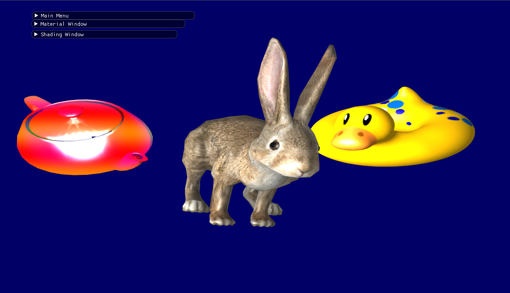

# A 3D renderer in OpenGL




This render is written as a project in a Computer Graphics course.

## Features
* Rendering .obj 3d models
* Transformations in space (Translations, Rotations)
* Camera Projections: Perspective & Orthographic 
* Support for multiple models, multiple cameras
* Lighting & Shading, 3 Shading models: Flat, Gouraud & Phong Shading.
* Texture mapping

## Building:
*Tested on Ubuntu 16.04, macOS 10.13.6, cmake version 3.12.0, make version 4.1*
* Clone this repo recursively to include third party depencdencies (Located inside ThirdParty/)
```console
git clone --recursive git@github.com:itamar8910/ComputerGraphics.git
cd ComputerGraphics
```
* Run cmake & build
```console
mkdir build && cd build
cmake ..
make
```
* Run the exectuable
```console
cd build/bin
./MeshViewer
```

## Releases:

* [Assignment 3](https://github.com/itamar8910/ComputerGraphics/releases/tag/Assignment3): Full implementation in OpenGL with GLSL
* [Assignment 2](https://github.com/itamar8910/ComputerGraphics/releases/tag/assignment2): Implementation in CPU, no texture support.
* [Assigment 1](https://github.com/itamar8910/ComputerGraphics/releases/tag/assignment1): Mesh viewer in CPU, no lighting.

## Contributors:

Itamar Shenhar, itamar8910@gmail.com

Tomer Keren, tomer.keren.dev@gmail.com

## Course Staff 

### Lecturer
*Roi Poranne*

[roiporanne@cs.haifa.ac.il](mailto:roiporanne@cs.haifa.ac.il)

URL: [https://www.inf.ethz.ch/personal/poranner/](https://www.inf.ethz.ch/personal/poranner/)


### Assistant
*Nave Zelzer*

[nzelzer@campus.haifa.ac.il](mailto:nzelzer@campus.haifa.ac.il)
